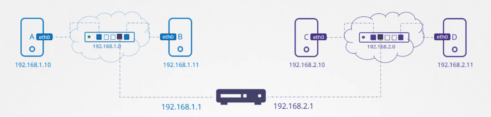
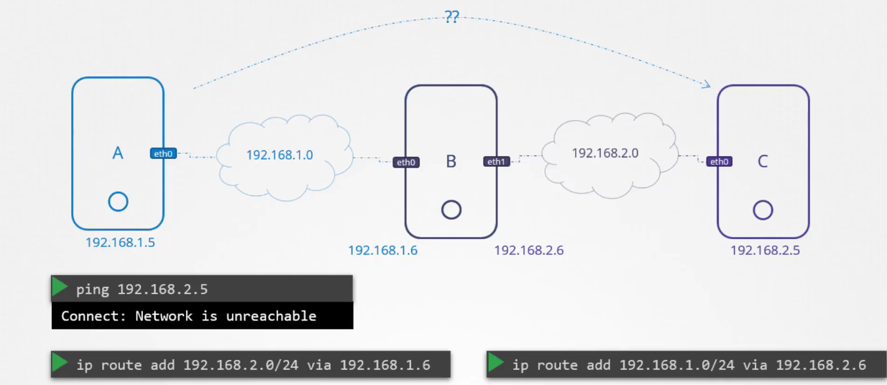

# Linux Basic Commands

## Index
some stuff here

## Switching

Let's talk about some concepts before jump into the practical part of applying commands to really understand them.

**🧠 First: What is a host?**
A host is just a computer or device connected to a network.
- Your laptop? → A host.
- A server? → A host.
- A router? → Also a host (with extra functions).

👉 It’s any device that can send or receive data over a network.

**🧩 Second: What is a network interface?**
A network interface is the thing on your host that connects it to a network.

There are different types:

| Interface Type | Example Name | Description |
|----------------|--------------|-------------|
| Ethernet       | eth0, enp3s0 | Wired connection port |
| Wi-Fi          | wlan0        | Wireless connection |
| Loopback       | lo           | Internal-only, for testing (127.0.0.1) |
| Virtual        | docker0, veth1234 | Virtual links created by tools like Docker, Mininet |

👉 So if a host is the whole machine, a network interface is like one of its "network ports".

Now, we can talk about connect hosts without misunderstandings!

To connect two systems (hosts), we need a switch that can be connected locally or virtually to both systems, creating a network. To connect one system to the switch (network), we need an interface (physical or virtual depending on the host) on both hosts. For Linux, we can use the `ip link` command to manage network interfaces. 

A network interface is a point of interconnection between a computer and a network, allowing the computer to communicate over the network. The `ip link` command is used to display and modify network interfaces, providing a way to manage the connections between the systems and the network.

👉 **Linux ip Command Syntax**
The ip command accepts objects (subcommands), options, and additional arguments, allowing users to configure and manage network interfaces, routes, tunneling, etc. Below is the basic command syntax:

```bash
ip [option] [subcommand] [arguments]
```

The following list introduces the most frequently used ip command objects:

- `link (l)` configures network interfaces.
- `address (addr/a)` modifies protocol addresses (IP, IPv6).
- `route (r)` alters routing tables.
- `neigh (n)` manipulates neighbor objects.

Consider that the hosts do not need to share exactly the same network interface; they just need to have one that can connect to the network and is compatible with the network's communication protocol. For example, two computers can have different types of network interfaces, such as a WiFi card and an Ethernet port, and still communicate because both interfaces are compatible with the protocol of a WiFi router.

So, we'll use a command to see our available network's interfaces:

```bash
ip link

>> eth0: <BROADCAST,MULTICAST,UP,LOWER_UP> mtu 1500 qdisc noqueue state UP mode DORMANT group default qlen 1000
>> link/ether c4:3d:1a:aa:ea:ba brd ff:ff:ff:ff:ff:ff
>> altname eth0s20f3

```

Then, we add a network to our network interface:
> The `addr` option isn't creating or adding a whole network, it just connecting our host to the specified existing network.

```bash
ip addr add 192.168.1.10/24 dev eth0
```
**What does this command do?**
- `ip addr add`: Command to add a new IP address.
- `192.168.1.10/24`: The IP address you are assigning, with subnet mask /24 (which means 255.255.255.0).
- `dev eth0`: Apply this configuration to the network device/interface called eth0. Here, `dev` is a keyword which stands for *"device"*.

So, now we can **share and receive info across the network** whose ip we pass to the `ip addr add` command.

## Routing & Gateways
A router is an intelligent device that is capable of mange and communicate multiple networks.

The gateway something like the door of the router, the way in into the router and its respective networks.
So, the systems/hosts need to know where that gateway is to can go trough it to the router networks.
To see the existing routing configuration on the system, we'll use the `route` command.

So, if we need to add a route of the router we have to secify the network ip and the gateway ip. Just like this:

```bash
# Command
ip route add <network_ip to reach>/<cidr> via <gateway_ip>

# Example
ip route add 192.168.2.0/24 via 192.168.1.1
```

<p align="center">
  
</p>

In the example `192.168.2.0` is the ip of the purple network (switch) and `192.168.1.1` is the ip of the gateway for the blue network where we're located trying to get access to the purple network.

At this point, consider that when we're sending packets (units of data that contain information like source/destination addresses and the actual data being transmitted) our host or system uses its own router table.

A routing table is like a GPS navigation system for network packets - it's a set of rules that tells data which path to take to reach its destination network through available gateways. It is used for the host to know where to send the packets but it does not know which one is the final destination of the packet.

The host can deliver data directly to the network if we know it, or in case of not having the info about the destination network it will deliver the packets to its respective `default gateway`.

For example, if we set `ip route add default via 192.168.1.1` we're telling the system:
> "If a packet is going to an unknown destination (not on the local network), send it to 192.168.1.1. It will know how to forward it."

But, what if we don't have a router but a **host that can act as an intermediary for two hosts?**

In this example, we just have to:
1. Make sure that B is **acting as a router**.
2. Add the network we're trying to communicate with through the gateway of the "router".

<p align="center">
  
</p>

But, there's a problem. If we try to ping the ip `192.168.2.5` we won't have a response back.

This happens by a default behaviour of Linux, it doesn't pass the packets from one interface (`eth0` for this example) to another (`eth1`). The main reason is for **security risk**, because in case of a private network in blue and a public one for the purple on the image, we don't want people in purple get access to info in blue network.

If we want to allow host B to forward packets across interfaces, we need to set it up.

```bash
# See the current boolean value of this behaviour
cat /proc/sys/net//ipv4/ip_forward

# Set it to True (this values is restored with reboots)
echo 1 > /proc/sys/net//ipv4/ip_forward

# To pin the value, we must set it into this path too
# /etc/sysctl/conf
net.ipv4.ip_forward = 1
```

## DNS Configurations in Linux


